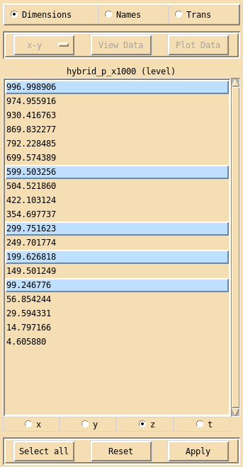

.. _dimension:

Dimension interface
===================

Clicking on the **Dimensions** button in the main xconv window brings up the 
**Dimension** interface. 

The **Dimension** interface is used to examine and sub-sample, the currently 
selected fields dimensions. Currently xconv only supports sub-sampling of 
the **z** (vertical) and **t** (time) dimensions. 

To sub-sample dimensions, first click on the dimension you require 
(**x**, **y**, **z** or **t**), then highlight the dimension values 
that are needed, finally click on **Apply**. 
The **Select all** button will highlight all the dimension values.
The **Reset** button will reset the highlighted dimension values to either
their initial state if **Apply** has not yet been used or to the state they 
were in when **Apply** was last used. 

Highlighting is performed as follows: clicking with the left mouse button will 
highlight that entry without changing any other highlighted entry, 
clicking with the middle mouse button will highlight that entry and all other 
entries will become unhighlighted, clicking with the right mouse button will 
highlight all entries between the current entry and the last entry to be 
highlighted, without changing any other highlighted entry.

