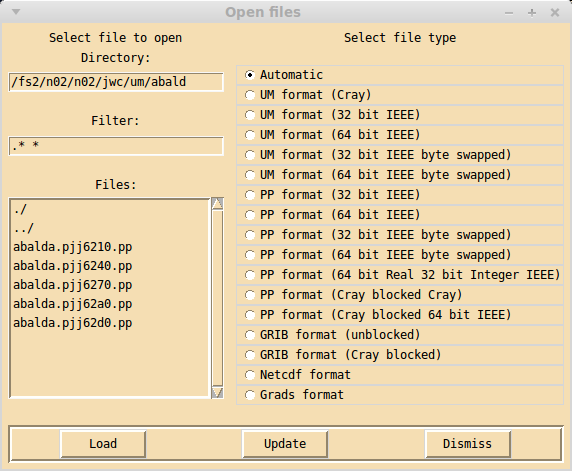

.. _open:

Open files window
=================

Clicking on the **Open** button in the main xconv window brings up the 
**Open files** window. 

On the left hand side are three boxes for selecting the files to be opened.
The file list is generated by listing all files which match the given filter in the given
directory. The initial directory is the one in which xconv was started, this may be edited
directly or it will change when a directory is selected from the list of files. The initial
filter matches all files (.* \*), this may also be edited e.g. to \*.nc if you wanted
to list netCDF files only. If the directory name or filter is edited, the 
changes will take effect either when the return key is pressed in the entry box or when the
**Update** button is clicked. There are two ways of selecting files, a
single file or directory can be selected by double clicking with the left mouse button,
alternatively a number of entries can be selected by highlighting them with the mouse and
clicking on the **Load** button. Highlighting is performed as follows: clicking with the
left mouse button will highlight that entry without changing any other highlighted entry, 
clicking with the middle mouse button will highlight that entry and all other entries will
become unhighlighted, clicking with the right mouse button will highlight all entries 
between the current entry and the last entry to be highlighted, without changing any other 
highlighted entry.

On the right hand side is a list of the file type of the files xconv is opening. By 
default **Automatic** is selected, this means xconv will try and work out the file type of 
the file being opened. This will usually open all file types known to xconv, but if for 
some reason it cannot correctly identify the file type, the actual file type can be 
selected from the list.

There are three buttons in this window, **Load** loads into xconv the 
highlighted files, 
**Update** will update the file list e.g. if extra files have been created or files 
deleted since the window was opened, also **Update** will update the current directory
and filter entries, **Dismiss** removes the **Open files** window.
