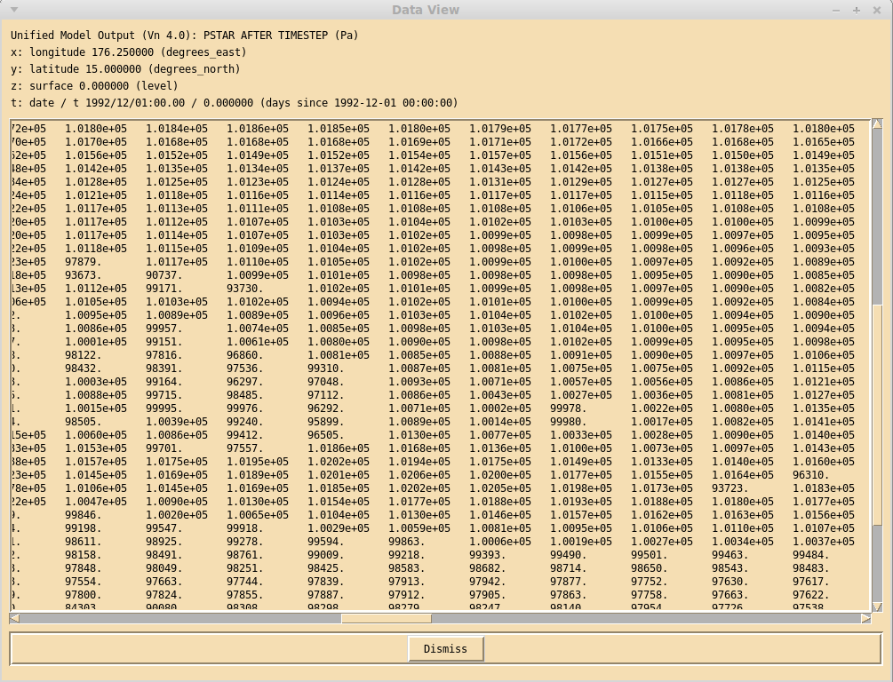

.. _view:

View data window
================

Clicking on the **View data** button in the main xconv window brings up the 
**View data** window. 

This window prints out all the data values of the selected 2D field.
When the mouse pointer is moved over the data values, the dimension
values are updated to reflect the pointer position.

There is one button in this window, **Dismiss** which removes the 
**View data** window.
